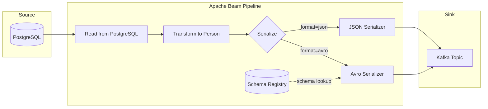

# Beam Kafka Pipeline

A Apache Beam pipeline that reads person data from PostgreSQL and writes it to Kafka with support for both JSON and Avro serialization formats. The pipeline includes Schema Registry integration for Avro schema evolution.

## Overview

This pipeline demonstrates how to:
- Read data from PostgreSQL using Apache Beam's JDBC connector
- Transform and serialize data to either JSON or Avro format
- Write data to Kafka with configurable serialization
- Use Confluent Schema Registry for Avro schema management

## Architecture



## Features

- **Flexible Data Source**: Reads person records from PostgreSQL
- **Multiple Serialization Formats**: 
  - JSON format for simple integration
  - Avro format with Schema Registry for schema evolution
- **Configurable Pipeline**: Command-line options for all key parameters
- **Testcontainers Integration**: Comprehensive integration tests using Testcontainers

## Configuration Options

| Option | Description | Default |
|--------|-------------|---------|
| `postgresqlUrl` | PostgreSQL JDBC URL | Required |
| `postgresqlUsername` | PostgreSQL username | Required |
| `postgresqlPassword` | PostgreSQL password | Required |
| `kafkaBootstrapServers` | Kafka bootstrap servers | Required |
| `kafkaTopic` | Kafka topic name | Required |
| `outputFormat` | Serialization format (json/avro) | json |
| `schemaRegistryUrl` | Schema Registry URL | Optional |

## Running Tests

The project includes three types of integration tests:
1. `JsonPersonPipelineContainerTest`: Tests JSON serialization
2. `AvroPersonPipelineContainerTest`: Tests basic Avro serialization
3. `SchemaRegistryPersonPipelineContainerTest`: Tests Avro with Schema Registry

Run tests using Maven:
```bash
mvn test
```

## Development

This project uses:
- Java 21
- Apache Beam
- Confluent Kafka
- Testcontainers
- Spotless for code formatting

Format code using:
```bash
mvn spotless:apply
```
